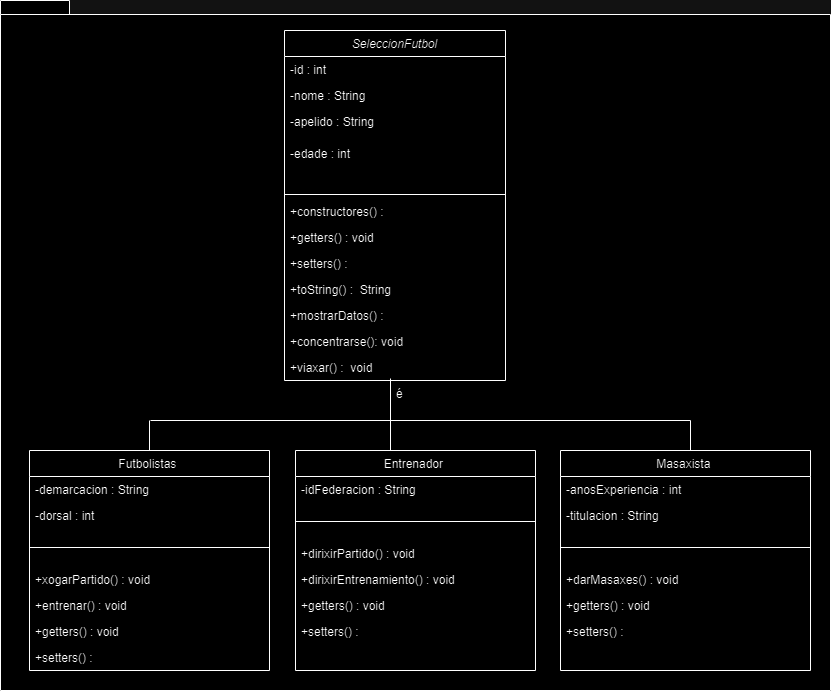
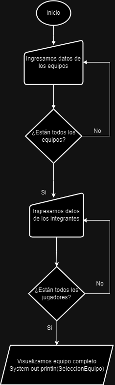

## EXPLICACIÓN DEL ETIQUETADO
1. En un programa creamos el punto jar.
2. Luego lo subimos al repositorio junto con el programa, añadiendo un commit.
3. Para etiquetar el commit del punto jar, tenemos que ver el **checksum** de ese commit en concreto.
4. Para visualizar el commit pasado ponemos  ***git show***, y copiamos los siete primeros codigos del checksum del commit del punto jar, ejemplo: ***e1234eee***.
5. Para añadir ese commit tardío del punto jar podemos hacerlo con ***git tag v1.0***(se puede poner la última versión con la que se trabaja) ***e1234ee***(este es el checksum del commit que hicimos del punto jar). Entonces sería ***git tag v1.0 e1234eee.***
6. Subimos el tag con el comando: ***git push origin v1.0***(la versión del commit).

## EXPLICACIÓN DEL RELEASE
1. Vamos a github y tomamos una etiqueta ya creada.
2. Nos vamos al apartado de *"Create release for tag"*.
3. Escogemos la rama y verificamos que sea la etiqueta que queremos.
4. Ponemos un titulo y una descripción al Release. También podemos ponerle un archivo, adjuntandolo.
5. Casi al finalizar podemos escoger si es un release último o anterior.
6. Luego de completar todo publicamos el release.
